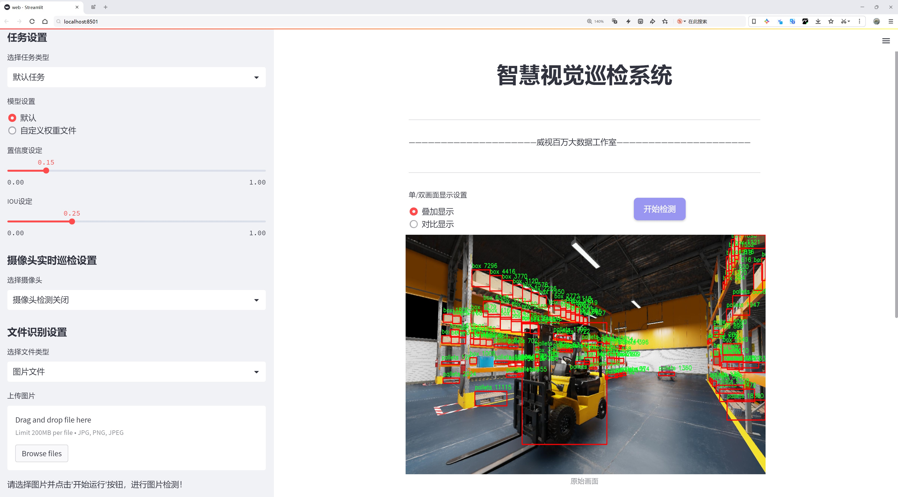
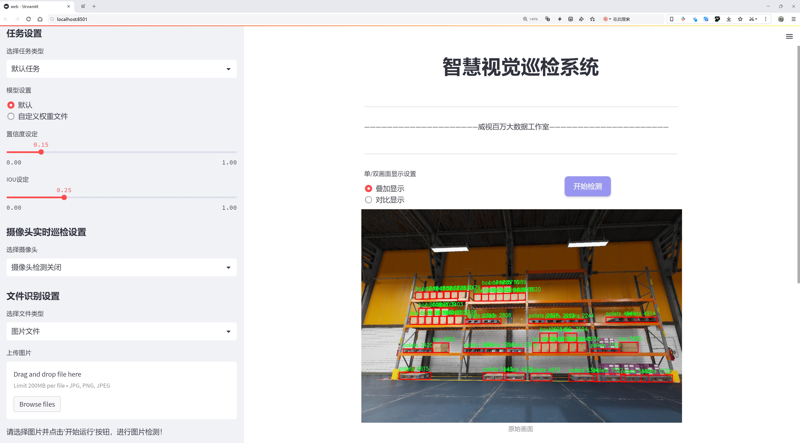
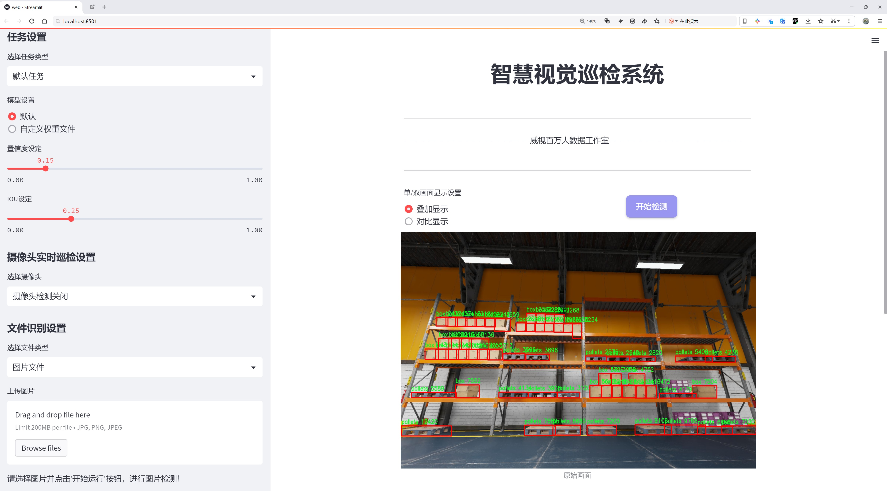
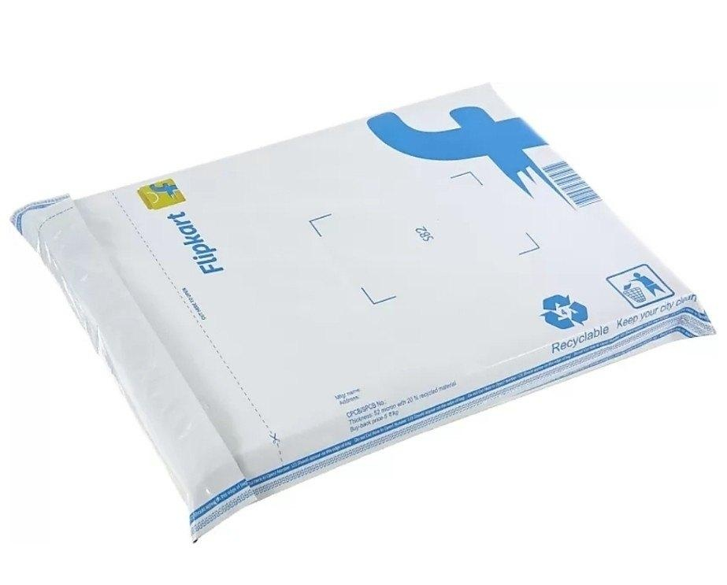
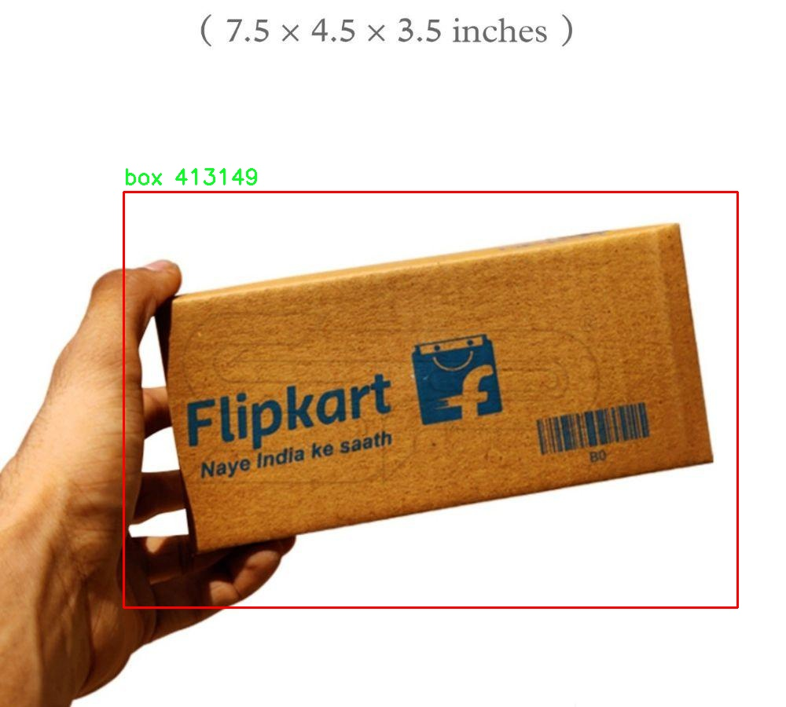
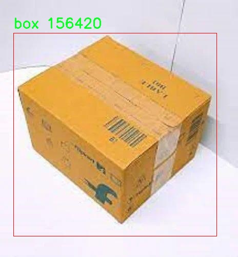
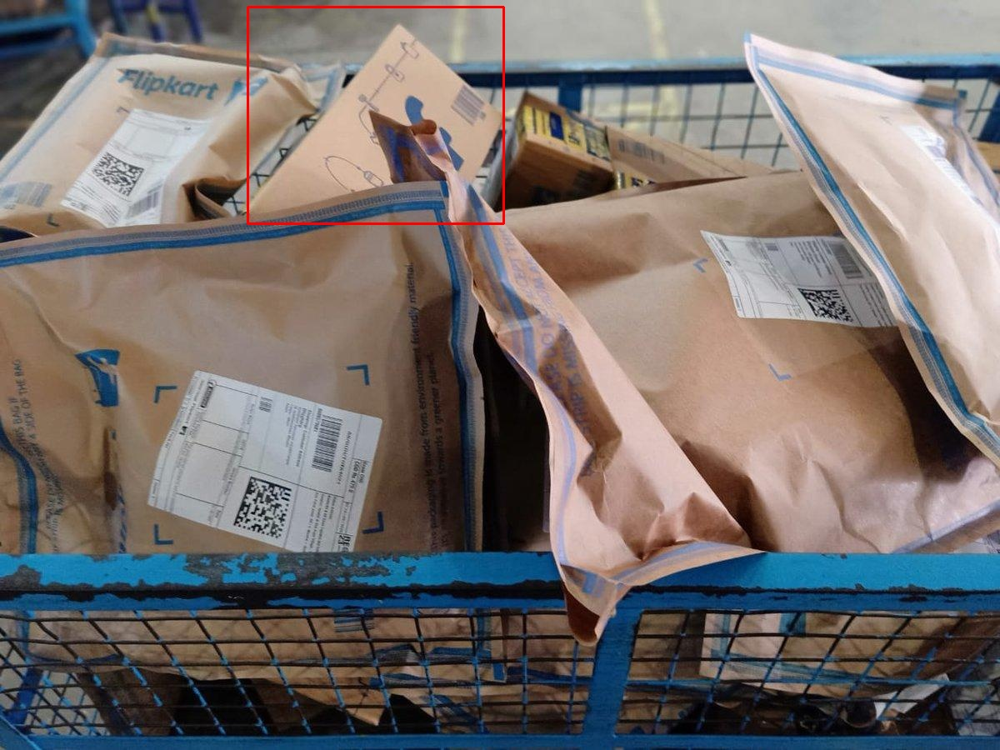
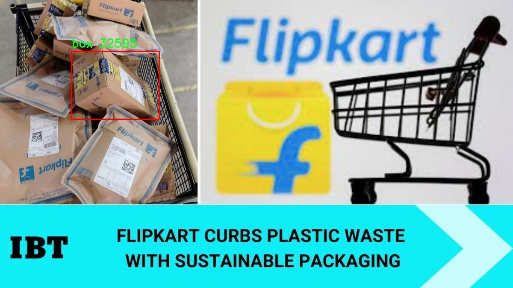

# 仓库场景物品检测分类检测系统源码分享
 # [一条龙教学YOLOV8标注好的数据集一键训练_70+全套改进创新点发刊_Web前端展示]

### 1.研究背景与意义

项目参考[AAAI Association for the Advancement of Artificial Intelligence](https://gitee.com/qunmasj/projects)

项目来源[AACV Association for the Advancement of Computer Vision](https://kdocs.cn/l/cszuIiCKVNis)

研究背景与意义

随着全球经济的快速发展和电子商务的蓬勃兴起，仓储物流行业面临着前所未有的挑战与机遇。高效的仓库管理不仅能够提升企业的运营效率，还能显著降低成本，提高客户满意度。在这一背景下，物品检测与分类技术的应用显得尤为重要。近年来，深度学习技术的迅猛发展为物品检测提供了新的解决方案，其中YOLO（You Only Look Once）系列模型因其高效性和实时性受到广泛关注。特别是YOLOv8作为最新版本，凭借其更高的检测精度和更快的推理速度，成为了研究者和工程师们的首选。

在仓库场景中，物品种类繁多，形态各异，传统的物品识别方法往往难以满足实际需求。以Vikas_Warehouse_Obj_detection数据集为基础，该数据集包含6200张图像，涵盖25个类别的物品，包括纸箱、叉车、金属物品、塑料袋等多种类型。这些物品在仓库的存储、搬运和管理过程中扮演着重要角色，因此，构建一个基于改进YOLOv8的物品检测与分类系统，将为仓库管理提供强有力的技术支持。

通过对该数据集的深入分析，可以发现其具有较高的多样性和复杂性，这为物品检测模型的训练提供了丰富的样本。然而，现有的YOLOv8模型在特定场景下仍存在一定的局限性，例如对小物体的检测精度不足、对遮挡物体的识别能力较弱等。因此，改进YOLOv8模型以适应仓库场景的特定需求，显得尤为重要。通过引入数据增强、特征融合等技术手段，可以有效提升模型在复杂环境下的鲁棒性和准确性，从而实现对仓库物品的高效检测与分类。

此外，随着社会对安全和效率的日益重视，仓库管理中的人机协作、社交距离等问题也逐渐浮出水面。数据集中包含的“社交距离”类别，正是对这一现象的反映。通过对人类行为的监测与分析，改进后的物品检测系统不仅能够提升仓库的运营效率，还能在一定程度上保障工作人员的安全。因此，该研究不仅具有重要的学术价值，也具备显著的实际应用意义。

综上所述，基于改进YOLOv8的仓库场景物品检测分类系统的研究，不仅能够推动深度学习技术在实际应用中的发展，还能为仓储物流行业的智能化转型提供新的思路与方法。通过提升物品检测的准确性和实时性，能够有效促进仓库管理的智能化水平，为企业的可持续发展奠定坚实的基础。

### 2.图片演示







##### 注意：由于此博客编辑较早，上面“2.图片演示”和“3.视频演示”展示的系统图片或者视频可能为老版本，新版本在老版本的基础上升级如下：（实际效果以升级的新版本为准）

  （1）适配了YOLOV8的“目标检测”模型和“实例分割”模型，通过加载相应的权重（.pt）文件即可自适应加载模型。

  （2）支持“图片识别”、“视频识别”、“摄像头实时识别”三种识别模式。

  （3）支持“图片识别”、“视频识别”、“摄像头实时识别”三种识别结果保存导出，解决手动导出（容易卡顿出现爆内存）存在的问题，识别完自动保存结果并导出到tempDir中。

  （4）支持Web前端系统中的标题、背景图等自定义修改，后面提供修改教程。

  另外本项目提供训练的数据集和训练教程,暂不提供权重文件（best.pt）,需要您按照教程进行训练后实现图片演示和Web前端界面演示的效果。

### 3.视频演示

[3.1 视频演示](https://www.bilibili.com/video/BV1vVxjebEuw/)

### 4.数据集信息展示

##### 4.1 本项目数据集详细数据（类别数＆类别名）

nc: 4
names: ['box', 'forklift', 'pallets', 'person']


##### 4.2 本项目数据集信息介绍

数据集信息展示

在现代仓库管理和物流行业中，物品检测与分类的自动化已成为提升效率和准确性的关键因素。为此，我们引入了名为“Vikas_Warehouse_Obj_detection”的数据集，该数据集专门用于训练和改进YOLOv8模型，以实现对仓库场景中物品的高效检测与分类。该数据集包含四个主要类别，分别是“box”（箱子）、“forklift”（叉车）、“pallets”（托盘）和“person”（人员），为模型提供了丰富的样本，以支持其在复杂环境中的学习和适应能力。

在“Vikas_Warehouse_Obj_detection”数据集中，每个类别的样本都经过精心挑选和标注，确保其在多样化的仓库场景中具有代表性。首先，关于“box”类别，数据集中包含了各种形状和尺寸的箱子，这些箱子可能是堆叠在一起的，也可能是单独放置在货架上。通过这种多样化的样本，模型能够学习到如何在不同的光照条件和视角下准确识别箱子，从而提高其在实际应用中的鲁棒性。

其次，叉车作为仓库中不可或缺的设备，其检测与分类同样至关重要。数据集中包含了多种类型的叉车，包括电动叉车和内燃叉车等，样本不仅展示了叉车在静止状态下的外观，还包括其在搬运货物时的动态场景。这种多样化的训练数据使得模型能够更好地理解叉车的运动特征，从而在实际操作中有效避免潜在的碰撞和事故。

托盘作为货物存储和运输的基础单元，其检测也在数据集中占据了重要位置。数据集中的托盘样本涵盖了不同的材质和尺寸，且常常与其他物品如箱子和叉车交互。这种复杂的场景设置为模型提供了挑战，促使其在学习过程中不断优化对托盘的识别能力，以适应实际仓库环境中的各种情况。

最后，人员的检测是确保仓库安全和高效运作的重要环节。数据集中包含了不同性别、年龄和穿着的人员样本，模拟了真实仓库中员工的工作状态。通过对人员的有效识别，模型不仅能够提高仓库操作的安全性，还能在智能化管理中发挥重要作用，例如实时监控和人员流动分析。

综上所述，“Vikas_Warehouse_Obj_detection”数据集通过多样化的样本和丰富的场景设置，为YOLOv8模型的训练提供了坚实的基础。其四个类别的设计不仅涵盖了仓库操作中的关键要素，还为模型的学习和适应能力提供了广阔的空间。通过有效利用该数据集，我们期望能够提升物品检测与分类系统的准确性和效率，为仓库管理的智能化进程贡献力量。











### 5.全套项目环境部署视频教程（零基础手把手教学）

[5.1 环境部署教程链接（零基础手把手教学）](https://www.ixigua.com/7404473917358506534?logTag=c807d0cbc21c0ef59de5)


[5.2 安装Python虚拟环境创建和依赖库安装视频教程链接（零基础手把手教学）](https://www.ixigua.com/7404474678003106304?logTag=1f1041108cd1f708b01a)

### 6.手把手YOLOV8训练视频教程（零基础小白有手就能学会）

[6.1 手把手YOLOV8训练视频教程（零基础小白有手就能学会）](https://www.ixigua.com/7404477157818401292?logTag=d31a2dfd1983c9668658)

### 7.70+种全套YOLOV8创新点代码加载调参视频教程（一键加载写好的改进模型的配置文件）

[7.1 70+种全套YOLOV8创新点代码加载调参视频教程（一键加载写好的改进模型的配置文件）](https://www.ixigua.com/7404478314661806627?logTag=29066f8288e3f4eea3a4)

### 8.70+种全套YOLOV8创新点原理讲解（非科班也可以轻松写刊发刊，V10版本正在科研待更新）

由于篇幅限制，每个创新点的具体原理讲解就不一一展开，具体见下列网址中的创新点对应子项目的技术原理博客网址【Blog】：


[8.1 70+种全套YOLOV8创新点原理讲解链接](https://gitee.com/qunmasj/good)

### 9.系统功能展示（检测对象为举例，实际内容以本项目数据集为准）

图9.1.系统支持检测结果表格显示

  图9.2.系统支持置信度和IOU阈值手动调节

  图9.3.系统支持自定义加载权重文件best.pt(需要你通过步骤5中训练获得)

  图9.4.系统支持摄像头实时识别

  图9.5.系统支持图片识别

  图9.6.系统支持视频识别

  图9.7.系统支持识别结果文件自动保存

  图9.8.系统支持Excel导出检测结果数据


### 10.原始YOLOV8算法原理

原始YOLOv8算法原理

YOLOv8算法是目标检测领域中的一项重要进展，由Glenn-Jocher提出，延续了YOLO系列算法的优良传统，尤其是YOLOv3和YOLOv5的设计理念。该算法在多个方面进行了创新和改进，旨在提升目标检测的精度和速度，满足日益增长的应用需求。

首先，YOLOv8在数据预处理阶段延续了YOLOv5的策略，采用了多种数据增强技术以提高模型的鲁棒性和泛化能力。这些增强手段包括马赛克增强（Mosaic）、混合增强（Mixup）、空间扰动（Random Perspective）和颜色扰动（HSV Augment）。通过这些方法，YOLOv8能够在训练过程中生成多样化的训练样本，从而使模型在面对复杂的真实场景时表现得更加稳健。

在骨干网络结构方面，YOLOv8在YOLOv5的基础上进行了优化，尤其是在特征提取模块的设计上。YOLOv5的主干网络通过使用步长为2的3×3卷积层进行特征图的降采样，并结合C3模块来强化特征。而在YOLOv8中，C3模块被新的C2f模块所替代。C2f模块通过引入更多的分支，丰富了梯度回传的路径，使得特征的学习更加高效。这种设计不仅提高了特征提取的能力，还保持了网络的轻量级特性，适应了多种应用场景的需求。

YOLOv8的特征融合网络采用了FPN（特征金字塔网络）和PAN（路径聚合网络）的结合结构，以实现多尺度信息的充分融合。尽管C3模块被替换为C2f模块，但整体结构与YOLOv5保持一致。这种设计使得YOLOv8能够有效地处理不同尺度的目标，增强了模型对小目标的检测能力。

在检测头的设计上，YOLOv8引入了解耦头（Decoupled Head）结构，这一创新源于YOLOX的设计理念。与传统的耦合头不同，解耦头将分类和定位任务分开处理，分别通过两条并行的分支进行特征提取。这种方法不仅提高了模型的检测精度，还加速了模型的收敛速度。解耦头的设计使得YOLOv8能够更好地适应复杂的目标检测任务，尤其是在多类目标同时存在的情况下。

标签分配策略也是YOLOv8的一大亮点。YOLOv5虽然引入了自动聚类候选框的功能，但其依赖于数据集的充分性，可能导致聚类结果与真实物体尺寸不匹配。YOLOv8则采用了与YOLOv6相同的TOOD（Task-Oriented Object Detection）策略，这是一种动态标签分配方法。通过使用目标边界框（target bboxes）和目标分数（target scores），YOLOv8能够更有效地进行正负样本的匹配。其损失函数主要包括类别损失和位置损失，其中类别损失采用了变焦损失（Varifocal Loss），而回归损失则结合了CIoU Loss和DFL Loss。这种损失函数的设计使得模型在训练过程中能够更加关注高质量的正样本，从而提升整体的检测性能。

YOLOv8的整体网络结构由输入层、骨干网络、特征融合网络和检测模块四部分组成。输入层负责对图像进行预处理，调整图像比例并实现增强。骨干网络采用了CSPDarknet结构，通过C2f模块的设计，进一步提高了特征提取的效率。特征融合网络则通过FPN和PAN的结合，促进了语义特征和定位特征的转移，增强了对不同尺度目标的检测能力。

在目标检测的实现上，YOLOv8s模型采用了一种无锚框（Anchor-Free）的检测方式，直接预测目标的中心点和宽高比例。这种方法减少了对锚框的依赖，提升了检测速度和准确度，使得YOLOv8在处理复杂场景时表现得更加出色。

总的来说，YOLOv8算法通过一系列的创新和改进，在目标检测的精度和速度上都取得了显著的提升。其灵活的网络结构和高效的特征提取方法，使得YOLOv8成为当前目标检测领域中的一项重要工具，广泛应用于自动驾驶、安防监控、工业检测等多个领域。随着YOLOv8的不断发展和完善，未来的目标检测任务将更加高效和精准。


### 11.项目核心源码讲解（再也不用担心看不懂代码逻辑）

#### 11.1 70+种YOLOv8算法改进源码大全和调试加载训练教程（非必要）\ultralytics\utils\torch_utils.py

以下是代码中最核心的部分，并附上详细的中文注释：

```python
import torch
import torch.nn as nn
import torch.nn.functional as F
from contextlib import contextmanager
from copy import deepcopy
import math
import os
import random
import time

@contextmanager
def torch_distributed_zero_first(local_rank: int):
    """在分布式训练中，确保所有进程在本地主进程完成某些操作之前等待。"""
    initialized = torch.distributed.is_available() and torch.distributed.is_initialized()
    if initialized and local_rank not in (-1, 0):
        dist.barrier(device_ids=[local_rank])  # 等待本地主进程
    yield
    if initialized and local_rank == 0:
        dist.barrier(device_ids=[0])  # 本地主进程完成后，其他进程继续

def select_device(device='', batch=0, newline=False, verbose=True):
    """
    根据提供的参数选择合适的PyTorch设备。

    Args:
        device (str | torch.device, optional): 设备字符串或torch.device对象。
        batch (int, optional): 模型使用的批量大小。
        newline (bool, optional): 如果为True，则在日志字符串末尾添加换行符。
        verbose (bool, optional): 如果为True，则记录设备信息。

    Returns:
        (torch.device): 选择的设备。
    """
    if isinstance(device, torch.device):
        return device

    device = str(device).lower().replace(' ', '')  # 转为小写并去除空格
    if device in ('cpu', 'cuda', 'mps'):
        os.environ['CUDA_VISIBLE_DEVICES'] = device  # 设置可见设备
    else:
        raise ValueError(f"无效的设备请求: {device}")

    return torch.device(device)

def fuse_conv_and_bn(conv, bn):
    """融合Conv2d()和BatchNorm2d()层以提高推理速度。"""
    fusedconv = nn.Conv2d(conv.in_channels,
                          conv.out_channels,
                          kernel_size=conv.kernel_size,
                          stride=conv.stride,
                          padding=conv.padding,
                          dilation=conv.dilation,
                          groups=conv.groups,
                          bias=True).requires_grad_(False).to(conv.weight.device)

    # 准备卷积层的权重
    w_conv = conv.weight.clone().view(conv.out_channels, -1)
    w_bn = torch.diag(bn.weight.div(torch.sqrt(bn.eps + bn.running_var)))  # 归一化BatchNorm权重
    fusedconv.weight.copy_(torch.mm(w_bn, w_conv).view(fusedconv.weight.shape))  # 计算融合后的权重

    # 准备偏置
    b_conv = torch.zeros(conv.weight.size(0), device=conv.weight.device) if conv.bias is None else conv.bias
    b_bn = bn.bias - bn.weight.mul(bn.running_mean).div(torch.sqrt(bn.running_var + bn.eps))
    fusedconv.bias.copy_(torch.mm(w_bn, b_conv.reshape(-1, 1)).reshape(-1) + b_bn)  # 计算融合后的偏置

    return fusedconv

def initialize_weights(model):
    """初始化模型权重为随机值。"""
    for m in model.modules():
        if isinstance(m, nn.Conv2d):
            nn.init.kaiming_normal_(m.weight, mode='fan_out', nonlinearity='relu')  # Kaiming初始化
        elif isinstance(m, nn.BatchNorm2d):
            m.eps = 1e-3  # 设置BatchNorm的epsilon
            m.momentum = 0.03  # 设置动量
        elif isinstance(m, (nn.Hardswish, nn.LeakyReLU, nn.ReLU, nn.ReLU6, nn.SiLU)):
            m.inplace = True  # 原地操作以节省内存

def time_sync():
    """返回PyTorch准确的时间。"""
    if torch.cuda.is_available():
        torch.cuda.synchronize()  # 同步CUDA
    return time.time()  # 返回当前时间

class EarlyStopping:
    """早停类，当指定的epochs数经过而没有改进时停止训练。"""

    def __init__(self, patience=50):
        """初始化早停对象。"""
        self.best_fitness = 0.0  # 最佳适应度
        self.best_epoch = 0  # 最佳epoch
        self.patience = patience  # 等待的epochs数
        self.possible_stop = False  # 可能停止的标志

    def __call__(self, epoch, fitness):
        """检查是否停止训练。"""
        if fitness is None:  # 如果fitness为None，则不停止
            return False

        if fitness >= self.best_fitness:  # 如果当前适应度更好
            self.best_epoch = epoch
            self.best_fitness = fitness
        delta = epoch - self.best_epoch  # 没有改进的epochs数
        self.possible_stop = delta >= (self.patience - 1)  # 可能停止
        stop = delta >= self.patience  # 如果超过耐心值则停止
        if stop:
            print(f'早停训练，因为在过去的{self.patience}个epochs中没有观察到改进。')
        return stop  # 返回是否停止的标志
```

### 代码核心部分分析
1. **设备选择**：`select_device`函数用于选择合适的计算设备（CPU或GPU），并进行环境变量设置。
2. **层融合**：`fuse_conv_and_bn`函数用于将卷积层和批归一化层融合，以提高推理速度。
3. **权重初始化**：`initialize_weights`函数用于初始化模型的权重，确保模型在训练开始时具有良好的性能。
4. **时间同步**：`time_sync`函数用于获取准确的时间，特别是在使用CUDA时。
5. **早停机制**：`EarlyStopping`类用于在训练过程中监控模型的性能，并在性能不再提升时提前停止训练。

这些部分是实现YOLO模型训练和推理的基础，确保了模型的高效性和准确性。

这个文件是Ultralytics YOLOv8算法改进源码的一部分，主要包含了一些与PyTorch相关的工具函数和类，旨在支持模型的训练、推理和性能分析。代码中使用了许多PyTorch的功能，下面是对文件中主要内容的逐步分析。

首先，文件导入了一些必要的库，包括数学运算、操作系统、随机数生成、时间管理、深度学习框架PyTorch及其相关模块。它还导入了一些Ultralytics特定的工具和配置，如默认配置字典和日志记录器。

接下来，文件定义了一些函数和类。其中，`torch_distributed_zero_first`是一个上下文管理器，用于在分布式训练中确保所有进程在本地主进程完成某些操作之前都处于等待状态。这对于协调多GPU训练非常重要。

`smart_inference_mode`函数用于根据PyTorch的版本选择合适的推理模式装饰器，确保在推理时不会计算梯度，从而节省内存和计算资源。

`select_device`函数用于选择合适的PyTorch设备（CPU或GPU），并验证所请求的设备是否可用。它还会设置环境变量`CUDA_VISIBLE_DEVICES`，以指定使用哪些GPU。

`time_sync`函数用于在多GPU环境中同步时间，以确保时间测量的准确性。

`fuse_conv_and_bn`和`fuse_deconv_and_bn`函数用于将卷积层和批归一化层融合，以提高模型的推理速度。这种融合可以减少模型的计算量和内存占用。

`model_info`函数用于输出模型的基本信息，包括参数数量、梯度数量和层数等。它还可以计算模型的FLOPs（每秒浮点运算次数），以评估模型的计算复杂度。

`initialize_weights`函数用于初始化模型的权重，确保模型在训练开始时有合理的初始值。

`scale_img`函数用于根据给定的比例缩放和填充图像张量，确保图像在输入模型时具有合适的尺寸。

`strip_optimizer`函数用于从训练好的模型中去除优化器信息，以便在推理时减少模型的大小。

`EarlyStopping`类用于实现早停机制，当训练过程中在指定的轮数内没有性能提升时，自动停止训练。这可以防止模型过拟合并节省计算资源。

文件中还定义了一些其他辅助函数，如计算模型的FLOPs、复制对象属性、检查模型是否为并行模型等。这些工具函数和类的设计使得YOLOv8模型的训练和推理过程更加高效和灵活。

总的来说，这个文件提供了一系列与PyTorch深度学习框架紧密结合的工具，旨在支持YOLOv8模型的训练、推理和性能分析，增强了模型的可用性和效率。

#### 11.2 ui.py

```python
import sys
import subprocess

def run_script(script_path):
    """
    使用当前 Python 环境运行指定的脚本。

    Args:
        script_path (str): 要运行的脚本路径

    Returns:
        None
    """
    # 获取当前 Python 解释器的路径
    python_path = sys.executable

    # 构建运行命令，使用 streamlit 运行指定的脚本
    command = f'"{python_path}" -m streamlit run "{script_path}"'

    # 执行命令
    result = subprocess.run(command, shell=True)
    # 检查命令执行结果，如果返回码不为0，则表示出错
    if result.returncode != 0:
        print("脚本运行出错。")


# 实例化并运行应用
if __name__ == "__main__":
    # 指定要运行的脚本路径
    script_path = "web.py"  # 这里可以直接指定脚本名，假设它在当前目录下

    # 运行脚本
    run_script(script_path)
```

### 代码核心部分及注释说明：

1. **导入模块**：
   - `import sys`：用于访问与 Python 解释器相关的变量和函数。
   - `import subprocess`：用于执行外部命令和程序。

2. **定义 `run_script` 函数**：
   - 该函数接收一个脚本路径作为参数，并使用当前 Python 环境来运行该脚本。
   - 使用 `sys.executable` 获取当前 Python 解释器的路径，以确保使用正确的 Python 环境。

3. **构建命令**：
   - 使用 `f-string` 格式化字符串构建运行命令，命令中包含 Python 解释器的路径和要运行的脚本。

4. **执行命令**：
   - 使用 `subprocess.run` 执行构建的命令，并通过 `shell=True` 允许在 shell 中执行。
   - 检查命令的返回码，如果返回码不为0，表示脚本运行出错，打印错误信息。

5. **主程序入口**：
   - 使用 `if __name__ == "__main__":` 确保该部分代码仅在直接运行脚本时执行。
   - 指定要运行的脚本路径，并调用 `run_script` 函数执行该脚本。

这个程序文件名为 `ui.py`，其主要功能是通过当前的 Python 环境来运行一个指定的脚本，具体是使用 Streamlit 框架来启动一个 Web 应用。

程序首先导入了必要的模块，包括 `sys`、`os` 和 `subprocess`，这些模块分别用于获取系统信息、操作系统功能和执行外部命令。还导入了 `abs_path` 函数，这个函数来自于 `QtFusion.path` 模块，主要用于获取文件的绝对路径。

在 `run_script` 函数中，程序接收一个参数 `script_path`，这是要运行的脚本的路径。函数内部首先获取当前 Python 解释器的路径，这样可以确保使用正确的 Python 环境来执行脚本。接着，构建一个命令字符串，命令的格式是通过 Python 解释器运行 Streamlit，并指定要运行的脚本路径。然后，使用 `subprocess.run` 方法来执行这个命令，`shell=True` 表示在 shell 中执行命令。

如果脚本运行过程中出现错误，`result.returncode` 将不等于 0，程序会打印出“脚本运行出错”的提示。

在文件的最后部分，使用 `if __name__ == "__main__":` 语句来确保只有在直接运行该文件时才会执行以下代码。此处指定了要运行的脚本路径为 `web.py`，并调用 `run_script` 函数来启动这个脚本。

总的来说，这个程序的目的是为了方便地启动一个基于 Streamlit 的 Web 应用，确保在正确的 Python 环境中运行，并处理可能出现的错误。

#### 11.3 70+种YOLOv8算法改进源码大全和调试加载训练教程（非必要）\ultralytics\data\__init__.py

```python
# Ultralytics YOLO 🚀, AGPL-3.0 license

# 从基础模块导入 BaseDataset 类
from .base import BaseDataset

# 从构建模块导入数据加载器和数据集构建函数
from .build import build_dataloader, build_yolo_dataset, load_inference_source

# 从数据集模块导入不同类型的数据集类
from .dataset import ClassificationDataset, SemanticDataset, YOLODataset

# 定义模块的公开接口，包含所有需要被外部访问的类和函数
__all__ = (
    'BaseDataset',        # 基础数据集类
    'ClassificationDataset',  # 分类数据集类
    'SemanticDataset',    # 语义分割数据集类
    'YOLODataset',        # YOLO特定的数据集类
    'build_yolo_dataset', # 构建YOLO数据集的函数
    'build_dataloader',   # 构建数据加载器的函数
    'load_inference_source' # 加载推理源的函数
)
```

### 注释说明：
1. **导入模块**：代码首先导入了必要的模块和类，这些模块和类是构建YOLO模型所需的基础组件。
2. **公开接口**：`__all__` 列表定义了该模块对外公开的接口，确保用户只访问到这些指定的类和函数，有助于模块的封装和使用。
3. **数据集类**：不同的数据集类（如分类、语义分割和YOLO特定数据集）提供了不同的功能，适用于不同的任务。
4. **构建函数**：构建数据加载器和数据集的函数是数据处理的重要部分，确保数据能够以合适的格式和批次加载到模型中。

这个程序文件是Ultralytics YOLO（You Only Look Once）算法的一部分，主要涉及数据处理和加载相关的功能。文件中首先通过注释标明了该项目的名称和许可证类型（AGPL-3.0）。接下来，文件导入了一些模块和类，这些模块和类是实现数据集管理和数据加载的基础。

具体来说，文件从同一包（即当前目录）中导入了几个重要的组件：`BaseDataset`、`build_dataloader`、`build_yolo_dataset`和`load_inference_source`。这些组件分别负责定义数据集的基本结构、构建数据加载器、构建YOLO数据集以及加载推理所需的数据源。

此外，文件还导入了三个具体的数据集类：`ClassificationDataset`、`SemanticDataset`和`YOLODataset`，这些类用于处理不同类型的数据集，分别对应分类任务、语义分割任务和YOLO目标检测任务。

最后，`__all__`变量定义了一个公共接口，列出了可以被外部导入的类和函数。这种做法有助于明确模块的公共API，避免不必要的内部实现细节暴露给用户，从而提高代码的可维护性和可读性。

总体而言，这个文件的主要功能是组织和提供YOLO算法中与数据集相关的基础功能，为后续的模型训练和推理提供支持。

#### 11.4 train.py

以下是代码中最核心的部分，并附上详细的中文注释：

```python
class DetectionTrainer(BaseTrainer):
    """
    DetectionTrainer类，继承自BaseTrainer类，用于基于检测模型的训练。
    """

    def build_dataset(self, img_path, mode="train", batch=None):
        """
        构建YOLO数据集。

        参数:
            img_path (str): 包含图像的文件夹路径。
            mode (str): 模式，`train`表示训练模式，`val`表示验证模式，用户可以为每种模式自定义不同的增强。
            batch (int, optional): 批次大小，仅用于`rect`模式。默认为None。
        """
        gs = max(int(de_parallel(self.model).stride.max() if self.model else 0), 32)  # 获取模型的最大步幅
        return build_yolo_dataset(self.args, img_path, batch, self.data, mode=mode, rect=mode == "val", stride=gs)

    def get_dataloader(self, dataset_path, batch_size=16, rank=0, mode="train"):
        """构造并返回数据加载器。"""
        assert mode in ["train", "val"]  # 确保模式是训练或验证
        with torch_distributed_zero_first(rank):  # 仅在DDP中初始化数据集 *.cache 一次
            dataset = self.build_dataset(dataset_path, mode, batch_size)  # 构建数据集
        shuffle = mode == "train"  # 训练模式下打乱数据
        if getattr(dataset, "rect", False) and shuffle:
            LOGGER.warning("WARNING ⚠️ 'rect=True'与DataLoader的shuffle不兼容，设置shuffle=False")
            shuffle = False
        workers = self.args.workers if mode == "train" else self.args.workers * 2  # 设置工作线程数
        return build_dataloader(dataset, batch_size, workers, shuffle, rank)  # 返回数据加载器

    def preprocess_batch(self, batch):
        """对一批图像进行预处理，包括缩放和转换为浮点数。"""
        batch["img"] = batch["img"].to(self.device, non_blocking=True).float() / 255  # 将图像转移到设备并归一化
        if self.args.multi_scale:  # 如果启用多尺度
            imgs = batch["img"]
            sz = (
                random.randrange(self.args.imgsz * 0.5, self.args.imgsz * 1.5 + self.stride)
                // self.stride
                * self.stride
            )  # 随机选择图像大小
            sf = sz / max(imgs.shape[2:])  # 计算缩放因子
            if sf != 1:
                ns = [
                    math.ceil(x * sf / self.stride) * self.stride for x in imgs.shape[2:]
                ]  # 计算新的形状
                imgs = nn.functional.interpolate(imgs, size=ns, mode="bilinear", align_corners=False)  # 进行插值
            batch["img"] = imgs  # 更新图像
        return batch

    def get_model(self, cfg=None, weights=None, verbose=True):
        """返回YOLO检测模型。"""
        model = DetectionModel(cfg, nc=self.data["nc"], verbose=verbose and RANK == -1)  # 创建检测模型
        if weights:
            model.load(weights)  # 加载权重
        return model

    def get_validator(self):
        """返回用于YOLO模型验证的DetectionValidator。"""
        self.loss_names = "box_loss", "cls_loss", "dfl_loss"  # 定义损失名称
        return yolo.detect.DetectionValidator(
            self.test_loader, save_dir=self.save_dir, args=copy(self.args), _callbacks=self.callbacks
        )  # 返回验证器

    def plot_training_samples(self, batch, ni):
        """绘制带有注释的训练样本。"""
        plot_images(
            images=batch["img"],
            batch_idx=batch["batch_idx"],
            cls=batch["cls"].squeeze(-1),
            bboxes=batch["bboxes"],
            paths=batch["im_file"],
            fname=self.save_dir / f"train_batch{ni}.jpg",
            on_plot=self.on_plot,
        )
```

### 代码核心部分说明：
1. **DetectionTrainer类**：用于处理YOLO模型的训练过程，继承自BaseTrainer。
2. **build_dataset方法**：构建YOLO数据集，支持训练和验证模式，允许用户自定义数据增强。
3. **get_dataloader方法**：构造数据加载器，负责加载数据集并设置相关参数，如批次大小和是否打乱数据。
4. **preprocess_batch方法**：对输入的图像批次进行预处理，包括归一化和可选的多尺度调整。
5. **get_model方法**：创建并返回YOLO检测模型，可以选择加载预训练权重。
6. **get_validator方法**：返回用于模型验证的验证器，设置损失名称。
7. **plot_training_samples方法**：绘制训练样本及其注释，便于可视化训练过程。

这个程序文件 `train.py` 是一个用于训练 YOLO（You Only Look Once）目标检测模型的实现，继承自 `BaseTrainer` 类。程序的主要功能是构建数据集、处理批次数据、设置模型属性、获取模型、验证模型、记录损失、绘制训练样本和绘制训练指标等。

首先，程序导入了一些必要的库和模块，包括数学运算、随机数生成、深度学习框架 PyTorch 的神经网络模块、Ultralytics 提供的数据处理和模型训练工具等。

`DetectionTrainer` 类是程序的核心，主要用于处理与目标检测相关的训练任务。它包含多个方法：

- `build_dataset` 方法用于构建 YOLO 数据集，接受图像路径、模式（训练或验证）和批次大小作为参数。它会根据模型的步幅和输入参数生成适合的 YOLO 数据集。

- `get_dataloader` 方法构建并返回数据加载器，确保在分布式训练中只初始化一次数据集。它根据模式决定是否打乱数据，并设置工作线程的数量。

- `preprocess_batch` 方法用于对批次图像进行预处理，包括缩放和转换为浮点数格式。它还支持多尺度训练，通过随机选择图像大小来增强模型的鲁棒性。

- `set_model_attributes` 方法用于设置模型的属性，包括类别数量和类别名称等，以确保模型与数据集的兼容性。

- `get_model` 方法返回一个 YOLO 检测模型，可以选择加载预训练权重。

- `get_validator` 方法返回一个用于验证 YOLO 模型的验证器，记录损失名称以便后续分析。

- `label_loss_items` 方法用于返回带有标签的训练损失项字典，方便记录和分析训练过程中的损失。

- `progress_string` 方法返回一个格式化的字符串，显示训练进度，包括当前的轮次、GPU 内存使用情况、损失值、实例数量和图像大小等信息。

- `plot_training_samples` 方法用于绘制训练样本及其标注，帮助可视化训练数据的质量。

- `plot_metrics` 方法用于从 CSV 文件中绘制训练指标，便于分析模型的训练效果。

- `plot_training_labels` 方法用于创建带标签的训练图，显示训练集中所有标注的边界框和类别信息。

总体来说，这个文件实现了 YOLO 模型训练的多个关键步骤，从数据准备到模型训练，再到结果可视化，提供了一个完整的训练流程。

#### 11.5 code\ultralytics\models\rtdetr\predict.py

以下是代码中最核心的部分，并附上详细的中文注释：

```python
import torch
from ultralytics.data.augment import LetterBox
from ultralytics.engine.predictor import BasePredictor
from ultralytics.engine.results import Results
from ultralytics.utils import ops

class RTDETRPredictor(BasePredictor):
    """
    RT-DETR（实时检测变换器）预测器，扩展自BasePredictor类，用于使用百度的RT-DETR模型进行预测。

    该类利用视觉变换器的强大功能，提供实时物体检测，同时保持高精度。它支持高效的混合编码和IoU感知查询选择等关键特性。
    """

    def postprocess(self, preds, img, orig_imgs):
        """
        对模型的原始预测结果进行后处理，以生成边界框和置信度分数。

        该方法根据置信度和类进行过滤，如果在`self.args`中指定了类。

        参数:
            preds (torch.Tensor): 模型的原始预测结果。
            img (torch.Tensor): 处理后的输入图像。
            orig_imgs (list或torch.Tensor): 原始未处理的图像。

        返回:
            (list[Results]): 包含后处理的边界框、置信度分数和类标签的Results对象列表。
        """
        # 获取预测结果的维度
        nd = preds[0].shape[-1]
        # 将预测结果分为边界框和分数
        bboxes, scores = preds[0].split((4, nd - 4), dim=-1)

        # 如果输入图像不是列表，则将其转换为numpy数组
        if not isinstance(orig_imgs, list):
            orig_imgs = ops.convert_torch2numpy_batch(orig_imgs)

        results = []
        for i, bbox in enumerate(bboxes):  # 遍历每个边界框
            # 将边界框从xywh格式转换为xyxy格式
            bbox = ops.xywh2xyxy(bbox)
            # 获取每个边界框的最大分数和对应的类
            score, cls = scores[i].max(-1, keepdim=True)
            # 根据置信度过滤边界框
            idx = score.squeeze(-1) > self.args.conf
            # 如果指定了类，则进一步过滤
            if self.args.classes is not None:
                idx = (cls == torch.tensor(self.args.classes, device=cls.device)).any(1) & idx
            # 过滤后的预测结果
            pred = torch.cat([bbox, score, cls], dim=-1)[idx]
            orig_img = orig_imgs[i]
            oh, ow = orig_img.shape[:2]  # 获取原始图像的高度和宽度
            # 将边界框的坐标缩放到原始图像的尺寸
            pred[..., [0, 2]] *= ow
            pred[..., [1, 3]] *= oh
            img_path = self.batch[0][i]  # 获取图像路径
            # 将结果添加到列表中
            results.append(Results(orig_img, path=img_path, names=self.model.names, boxes=pred))
        return results

    def pre_transform(self, im):
        """
        在将输入图像输入模型进行推理之前，对其进行预处理。输入图像被调整为方形比例并填充。

        参数:
            im (list[np.ndarray] | torch.Tensor): 输入图像，形状为(N,3,h,w)的张量，或[(h,w,3) x N]的列表。

        返回:
            (list): 预处理后的图像列表，准备进行模型推理。
        """
        # 创建LetterBox对象以进行图像调整
        letterbox = LetterBox(self.imgsz, auto=False, scaleFill=True)
        # 对每个图像进行调整并返回
        return [letterbox(image=x) for x in im]
```

### 代码核心部分说明：
1. **类定义**：`RTDETRPredictor`类继承自`BasePredictor`，用于实现RT-DETR模型的预测功能。
2. **后处理方法**：`postprocess`方法对模型的原始预测结果进行处理，生成边界框和置信度分数，并根据置信度和类别进行过滤。
3. **预处理方法**：`pre_transform`方法在将图像输入模型之前，对图像进行调整，确保其为方形并适合模型输入。

该程序文件 `predict.py` 是一个用于实时目标检测的预测器，基于百度的 RT-DETR 模型，继承自 `BasePredictor` 类。它利用视觉变换器的强大能力，提供高效的实时目标检测，同时保持较高的准确性。该类支持高效的混合编码和 IoU 感知查询选择等关键特性。

在文件的开头，导入了必要的库和模块，包括 PyTorch 以及用于数据增强和结果处理的相关工具。接着定义了 `RTDETRPredictor` 类，该类包含了一些重要的属性和方法。

`postprocess` 方法用于对模型的原始预测结果进行后处理，以生成边界框和置信度分数。该方法首先将预测结果分为边界框和分数，然后根据置信度和指定的类别进行过滤。处理后的结果以 `Results` 对象的形式返回，包含了边界框、置信度分数和类别标签。

`pre_transform` 方法用于在将输入图像传递给模型进行推理之前，对其进行预处理。具体来说，该方法将输入图像进行信箱填充，以确保其具有正方形的宽高比和填充比例。输入图像可以是一个张量或一个图像列表，返回的则是经过预处理的图像列表，准备好进行模型推理。

该文件还提供了一个使用示例，展示了如何实例化 `RTDETRPredictor` 并调用其 `predict_cli` 方法进行预测。整体而言，这个文件为使用 RT-DETR 模型进行目标检测提供了一个完整的预测框架。

#### 11.6 70+种YOLOv8算法改进源码大全和调试加载训练教程（非必要）\ultralytics\models\__init__.py

以下是代码中最核心的部分，并附上详细的中文注释：

```python
# Ultralytics YOLO 🚀, AGPL-3.0 license

# 从当前模块导入 RTDETR、SAM 和 YOLO 类
from .rtdetr import RTDETR  # 导入 RTDETR 类
from .sam import SAM        # 导入 SAM 类
from .yolo import YOLO      # 导入 YOLO 类

# 定义可以被外部导入的类，简化导入过程
__all__ = 'YOLO', 'RTDETR', 'SAM'  # 允许使用 'from module import *' 时只导入这些类
```

### 注释说明：
1. **导入模块**：使用 `from .module import Class` 语法从当前包中导入特定的类。这种方式可以使得代码结构更加清晰，并且避免命名冲突。
2. **`__all__` 列表**：定义了一个特殊的变量 `__all__`，它指定了当使用 `from module import *` 时，哪些类可以被导入。这样可以控制模块的公共接口，避免不必要的类被暴露给用户。

这个程序文件是Ultralytics YOLO（You Only Look Once）算法的一部分，主要用于模型的组织和导入。文件中首先包含了一条版权声明，表明该代码遵循AGPL-3.0许可证。

接下来，文件通过相对导入的方式引入了三个模块：RTDETR、SAM和YOLO。这些模块可能分别实现了不同的目标检测算法或功能，RTDETR和SAM可能是YOLO的改进版本或相关的辅助模块。

最后，`__all__`变量被定义为一个包含字符串的元组，列出了可以通过`from . import *`语句导入的模块。这种做法可以简化导入过程，使得用户在使用这个包时能够更方便地访问YOLO、RTDETR和SAM这三个模块。

总体来看，这个文件的主要功能是组织和简化YOLO相关模块的导入，使得用户在使用这些模型时更加方便。

### 12.系统整体结构（节选）

### 整体功能和构架概括

该项目是一个完整的目标检测框架，主要基于YOLOv8算法及其改进版本，提供了从数据加载、模型训练到推理和结果可视化的全流程支持。项目的架构设计清晰，模块化程度高，便于扩展和维护。以下是项目的主要功能模块：

1. **数据处理**：包括数据集的构建、数据加载和预处理，确保模型能够接收到合适格式的数据。
2. **模型训练**：提供了训练过程的实现，包括模型的初始化、损失计算、训练进度监控等。
3. **模型推理**：实现了对训练好的模型进行推理的功能，支持实时目标检测。
4. **工具函数**：提供了一些辅助功能，如设备选择、时间同步、模型权重初始化等，增强了训练和推理的效率。
5. **可视化**：支持训练样本和训练指标的可视化，帮助用户理解模型的训练过程和效果。

### 文件功能整理表

| 文件路径                                                                                      | 功能描述                                               |
|----------------------------------------------------------------------------------------------|------------------------------------------------------|
| `ultralytics/utils/torch_utils.py`                                                          | 提供与PyTorch相关的工具函数和类，支持模型训练和推理。 |
| `ui.py`                                                                                      | 启动基于Streamlit的Web应用，用于模型的可视化和交互。   |
| `ultralytics/data/__init__.py`                                                              | 组织数据集相关的模块，提供数据集构建和加载功能。       |
| `train.py`                                                                                   | 实现YOLO模型的训练流程，包括数据处理和训练监控。       |
| `ultralytics/models/rtdetr/predict.py`                                                     | 实现RT-DETR模型的推理功能，处理输入图像并返回预测结果。 |
| `ultralytics/models/__init__.py`                                                            | 组织模型相关的模块，简化模型的导入过程。               |
| `ultralytics/nn/backbone/efficientViT.py`                                                  | 实现EfficientViT网络结构，作为YOLO模型的骨干网络。     |
| `ultralytics/data/loaders.py`                                                                | 提供数据加载器的实现，支持多种数据集格式和批处理。     |
| `ultralytics/models/sam/modules/transformer.py`                                            | 实现SAM（Segment Anything Model）模块的Transformer部分。 |
| `ultralytics/engine/exporter.py`                                                            | 实现模型导出功能，支持将训练好的模型保存为不同格式。     |
| `ultralytics/models/yolo/classify/__init__.py`                                             | 组织YOLO分类相关的模块，提供分类功能的实现。           |
| `ultralytics/utils/loss.py`                                                                 | 定义损失函数，计算模型训练过程中的损失值。             |
| `val.py`                                                                                     | 实现模型验证功能，评估模型在验证集上的性能。           |

这个表格总结了项目中各个文件的主要功能，帮助理解项目的整体结构和各个模块之间的关系。

注意：由于此博客编辑较早，上面“11.项目核心源码讲解（再也不用担心看不懂代码逻辑）”中部分代码可能会优化升级，仅供参考学习，完整“训练源码”、“Web前端界面”和“70+种创新点源码”以“13.完整训练+Web前端界面+70+种创新点源码、数据集获取”的内容为准。

### 13.完整训练+Web前端界面+70+种创新点源码、数据集获取


# [下载链接：https://mbd.pub/o/bread/ZpuZmpxp](https://mbd.pub/o/bread/ZpuZmpxp)